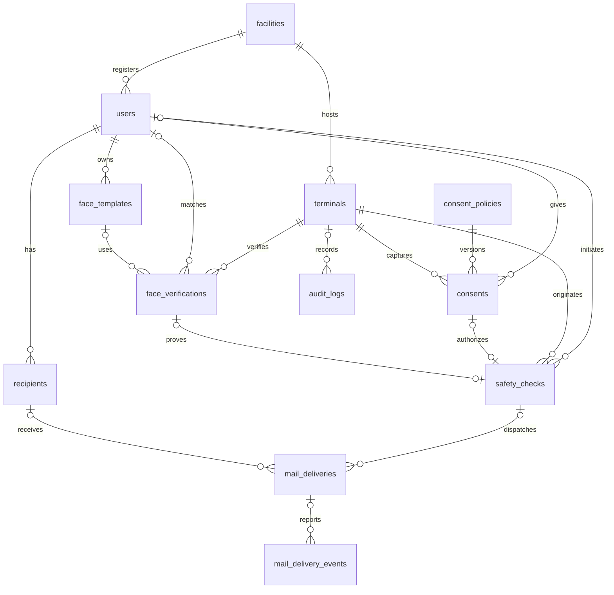

# PostgreSQL 数据库设计

依据 `anshin-anpi-admin-source/docs/specs/安心安否確認システム_開発仕様書_v1.0.docx` 第 10 章，以及第 7～9、11、13～14 章的关联要求。目标数据库为项目 Docker Compose 中的 PostgreSQL 17。

## 运行与迁移

在项目根目录执行：

```powershell
docker compose up -d postgres
.\scripts\database.ps1 -Action migrate
.\scripts\database.ps1 -Action status
```

脚本使用容器中的 `POSTGRES_DB` 和 `POSTGRES_USER`，无需在命令行填写密码。主机连接沿用 `.env`：默认 `localhost:5433/anshin`，同一 Compose 网络内为 `postgres:5432`。

新建空 Docker 数据卷时，`database/migrations` 会通过 PostgreSQL 初始化目录自动执行；已有数据卷使用上面的迁移命令。每个迁移在事务中执行，以数据库事务锁避免同时迁移，以 `schema_migrations` 记录版本。重复执行会跳过已经应用的版本。已有迁移不要修改，应增加 `002_*.sql` 等新文件。迁移失败会回滚该迁移。

## 表与规格书对应

共 12 张业务表，另有 1 张迁移记录表；不包含默认管理员、虚构用户或正式同意文面。

Node.js 用户端 API 的 `002_user_api` 迁移另补充 5 张支持表：`api_enrollments`（登记关联）、`api_sessions`（短期令牌摘要）、`api_idempotency`（加密成功响应）、`face_index_leases`（云端索引租约）、`face_cleanup_jobs`（云端特征清理队列）。当前共有 18 张表。Rekognition 模板以 `template_format=provider_reference` 标注；邮件状态增加 `sending`、`unknown`，避免外部请求中断后重复发送。

| 表 | 来源 | 主要字段与用途 |
| --- | --- | --- |
| `users` | 第 10 章 | `user_id`、`facility_id`、`encrypted_display_name`、`display_name_lookup_hmac`、`status`、`registered_at`、`suspended_at`、`deleted_at`、`purge_after`；登记人及生命周期 |
| `face_templates` | 第 10 章 | `template_id`、`user_id`、`encrypted_template`、`encryption_key_id`、`provider`、`model_version`、`threshold_version`、`status`、`revoked_at`、`purge_after`；加密脸部特征 |
| `recipients` | 第 10 章 | `recipient_id`、`user_id`、`encrypted_name`、`encrypted_email`、`email_lookup_hmac`、`order_no`、`status`、`bounce_count`、`last_bounced_at`、删除期限；联系人 |
| `consents` | 第 10 章 | `consent_id`、`user_id` 或 `temp_id`、`consent_type`、`policy_version`、`consented_at`、`terminal_id`、`result`、`subject_erased_at`；同意事实 |
| `safety_checks` | 第 10 章 | `check_id`、`user_id`、`terminal_id`、`check_type`、`verification_id`、`verified_at`、`consent_id`、`idempotency_key`、`request_sha256`、`status`、`expires_at`；一次发送操作 |
| `mail_deliveries` | 第 10 章 | `delivery_id`、`check_id`、`user_id`、`recipient_id`、加密邮箱快照、`provider`、`provider_message_id`、`status`、尝试次数、下次重试时间、各配信时间；每个收件人的独立结果 |
| `audit_logs` | 第 10 章 | `log_id`、`actor_type`、`actor_id`、`action`、`target_type`、`target_id`、`result`、`occurred_at`、`request_id`、HMAC 与签名键标识；审计记录 |
| `terminals` | 第 10 章 | `terminal_id`、`facility_id`、`terminal_code`、`name`、`status`、`app_version`、`credential_fingerprint`、`last_seen_at`；终端 |
| `facilities` | 补充 | `facility_id`、`facility_code`、`name`、`timezone`、`status`；设施与显示时区 |
| `consent_policies` | 补充 | `(policy_version, consent_type)`、`title`、`body`、`content_sha256`、`status`、`published_at`、`retired_at`、`requires_reconsent`；同意文面版本 |
| `face_verifications` | 补充 | `verification_id`、候选 `user_id`、`template_id`、`terminal_id`、`purpose`、`result`、第一/第二候选分数、阈值与版本、生体及质量判定；脸部识别证据 |
| `mail_delivery_events` | 补充 | `event_id`、`delivery_id`、`provider_event_id`、`provider_message_id`、`event_type`、发生/接收/处理时间；邮件服务商回调去重与处理 |
| `schema_migrations` | 技术管理 | `version`、`applied_at`；已执行迁移 |

逻辑规格中的 `users.display_name`、`recipients.name` 分别映射为物理字段 `encrypted_display_name`、`encrypted_name`。API 解密后仍可返回原来的 `displayName`、`name`。这样姓名也可按第 10.2 节的个人数据生命周期管理。



历史表中的部分关联允许为空，以支持用户物理删除、同意记录过期和日志保留；新建发送操作及邮件记录时，触发器要求关联完整。`users.facility_id` 表示登记设施，本版不把它作为租户隔离边界；跨设施使用权限由后端决定。

## 字段约定

- 主键采用 UUID；审计日志使用递增 `bigint`，便于排序与归档。
- 时间采用 `timestamptz`，容器会话和日志时区设为 UTC。界面按设施 `timezone` 转换，默认 `Asia/Tokyo`。设施时区必须存在于 PostgreSQL 时区列表。
- 可变实体具有 `created_at`、`updated_at`、`row_version`。更新触发器保留创建时间、更新时间并递增版本。后端更新使用 `WHERE ... AND row_version = :expected_version` 防止覆盖别人修改。
- 密文为 `bytea`，由后端进行 AES-256-GCM 等认证加密，封装格式应包含版本、随机 nonce 和认证标签。`encryption_key_id` 只存 KMS 键引用，数据库不存密钥。数据库不会自动加密传入值。
- 姓名精确搜索及邮箱去重使用 HMAC-SHA-256（32 字节），避免保存明文搜索字段。邮箱与界面保持一致，先 `trim`、转小写，再计算 HMAC。搜索键与加密键分离；更换搜索键需统一重建相关索引值，避免不同键产生的摘要绕过邮箱去重。
- 密文字段无法在数据库中验证原文长度、邮箱格式及 HTML/控制字符；后端必须先校验再加密。姓名限制为 1～50 字符。
- 不保存脸部原图、邮件正文、Webhook 原始 payload 或自由格式错误详情。`error_code` 仅保存固定错误代码；审计的 actor/target 字段仅放不透明 ID，不放姓名或邮箱。

## 状态与约束

| 对象 | 状态 |
| --- | --- |
| 登记人 | `pending_registration`、`active`、`suspended`、`deleted` |
| 脸部模板 | `active`、`revoked`、`deleted` |
| 联系人 | `active`、`disabled`、`needs_correction`、`deleted` |
| 同意文面 | `draft`、`published`、`retired` |
| 同意结果 | `granted`、`denied`、`withdrawn` |
| 识别结果 | `matched`、`no_match`、`ambiguous`、`quality_failed`、`liveness_failed`、`error` |
| 发送操作 | `queued`、`processing`、`accepted`、`partially_accepted`、`failed`、`cancelled` |
| 宛先配信结果 | `queued`、`accepted`、`delivered`、`bounced`、`failed`、`cancelled` |

联系人槽位只能为 1 或 2，同一用户未删除联系人的槽位与邮箱摘要均唯一。`active` 用户在事务提交时必须至少有 1 个未删除联系人；临时停用或待修正联系人仍占槽位，只有 `active` 联系人可以发送。删除最后一个联系人时，可在同一事务把用户改为 `suspended` 并设置 `purge_after`。联系人变化会更新用户行，配合延迟约束防止两次并发删除把联系人数量降为 0；在可重复读隔离级别下可能需要重试整个事务。

每名用户仅允许一个有效脸部模板。重录时，在同一事务撤销旧模板并插入新模板。`matched` 必须通过质量与生体判定，并达到阈值和候选分差；不同 SDK 的分数由适配层转换到 0～1。

每种同意类型只允许一个 `published` 版本。公开后的正文及摘要不可原地修改；新增文面版本并把旧版标记为 `retired`。同意结果不可覆盖，撤回需要新增记录；只允许把临时登记同意关联到正式用户，或在删除时清除主体关联。

发送记录通过复合外键将同意、脸部识别结果与同一用户、同一终端、同一业务类型关联。拒绝同意、识别失败、暂停用户或停用终端不能新建发送。一次同意、一次识别只能用于一次发送操作；重复请求应返回已有事件。

`(terminal_id, idempotency_key)` 防止重复创建发送事件；`(check_id, recipient_id)` 和 `(check_id, recipient_order_no)` 防止同一事件重复创建邮件。注册确认邮件也使用 `safety_checks`，通过 `check_type = 'registration'` 区分，不需要创建没有事件归属的邮件。

`accepted` 表示服务商已接受，必须有服务商消息 ID、受付时间及尝试次数；`delivered` 和 `bounced` 另需对应时间。最多尝试 3 次（初次加 2 次重试）。`(provider, provider_event_id)` 去重邮件回调；后端仍须验证签名并处理乱序事件。

## 后端事务约定

1. 同意前的脸部、姓名只放终端临时内存或符合要求的临时存储，不写入这些持久化表。`temp_id` 仅用于同意关联，不携带个人信息。
2. 确认登记后，在一个事务保存 `pending_registration` 用户、联系人、脸部模板和同意记录。登记照合、至少一个注册邮件受付成功后，才由后端设置 `active` 和 `registered_at`。
3. 安否发送前完成质量、生体、候选差判定和本人确认。后端检查当前用户、模板、终端、同意版本，以及本人操作的短期有效期；这些运行时授权不会仅靠表约束完整实现。
4. 在一个事务保存本次同意、`safety_checks` 和 1～2 条 `mail_deliveries`。同一幂等键输入不一致时，比较 `request_sha256` 并返回冲突。不要把“重复键”当作发起新邮件的理由。
5. 工作进程使用行锁领取邮件，并在真正发送前重新确认用户/联系人可用、同意未撤回和 `expires_at` 未过期。使用 `delivery_id` 作为服务商幂等键；API 超时结果不确定时先查询，避免服务商已接受却再次发信。数据库唯一约束本身不能保证外部邮件系统恰好发送一次。
6. 回调处理在事务中插入去重事件并更新配信结果；退信或投诉应标记联系人待修正。错误重试只针对未接受的收件人，且不得在用户操作过期后继续发送。

## 保留与删除

规格书中的 30 天个人数据删除、1 年日志保留、35 天备份保留均为待确认方案。表中日志 `retain_until` 默认 1 年，个人数据 `purge_after` 由后端明确赋值，不在这次建表时启动定期删除任务。

- 逻辑删除用户：设置 `status = 'deleted'`、`deleted_at`、`purge_after`。暂停用户同样需设置删除期限，并立即从照合/发送流程排除。脸部旧模板与已删除联系人各自可设置清理期限。
- 物理删除用户：脸部模板、联系人级联删除；同意和发送记录清除用户关联。未发送事件取消；所有保留邮件的邮箱快照同步清除。删除单个联系人也会清除其历史邮件邮箱快照。
- 保留记录不含姓名/邮箱，但审计中的不透明主体 ID 仍有相关性，属于去标识记录，不宣称完全匿名。
- 审计记录禁止更新、禁止整体清空；保留期限到达后允许逐行删除。HMAC 链字段供后端外部签名、验证和锚定使用，这次只建立存储结构，尚未实现完整防篡改验证；数据库所有者仍有管理权限。
- 清理任务需覆盖：脸部模板、联系人、用户、同意、识别记录、发送事件、邮件结果、Webhook 和审计记录。按各自期限批量删除，避免长事务；因删除关联而保留的历史记录仍按原期限清理。
- 备份轮转和数据库访问角色需要在运维/后端接入时实现。当前 `.env` 中的容器初始化账号用于本地管理，业务服务上线时应使用单独的最小权限账号。

## 验证

空的开发数据库可以执行以下检查，所有模拟记录在最终 `ROLLBACK` 中撤销；审计序列可能产生正常的编号间隙：

```powershell
.\scripts\database.ps1 -Action test
```

检查覆盖联系人上下限、重复邮箱、跨用户关联、同意不可变、脸部匹配条件、发送及回调去重、重试上限、配信证据、更新时间、审计保护以及个人数据删除。测试文面使用临时公开版本，因此有正式公开文面的数据库应在独立测试库运行：

```powershell
# 先在同一 PostgreSQL 容器中创建独立的空测试库。
.\scripts\database.ps1 -Action migrate -Database anshin_schema_verify_local
.\scripts\database.ps1 -Action test -Database anshin_schema_verify_local
python .\database\tests\concurrency.py --database anshin_schema_verify_local
```

并发测试只接受 `anshin_schema_verify_` 前缀的独立数据库，分别验证 READ COMMITTED 与 REPEATABLE READ 下删除最后两个联系人的竞争。

PostgreSQL 约束行为参考：[复合外键与指定列 SET NULL](https://www.postgresql.org/docs/17/ddl-constraints.html)、[事务末执行的约束触发器](https://www.postgresql.org/docs/17/sql-createtrigger.html)。

Node.js 用户端后端已在 `backend/` 实现 PostgreSQL API、KMS 适配、邮件工作进程及脸部外部特征清理，参阅 [后端说明](../backend/README.md)。应用现有的 `db/schema.ts` 仍是 Cloudflare D1 模板，页面仍用模拟数据；AWS 资源、前端连接、管理端认证、保留期限的定期物理删除与生产备份仍需后续接入。
